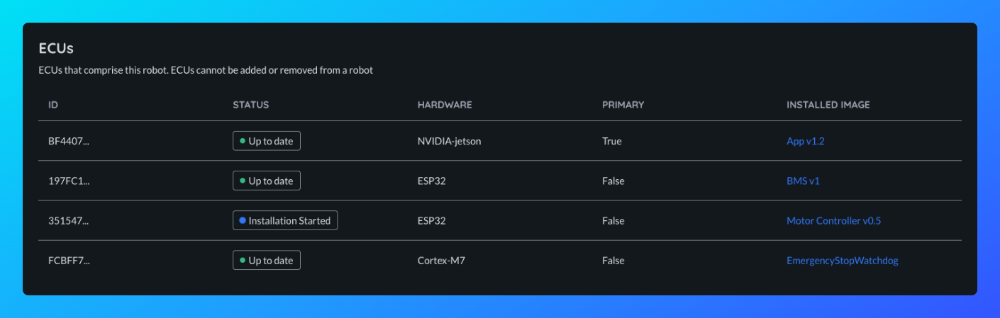

## ECUs

An Electronic Control Unit (ECU) is an embedded computer installed to perform some computation on a robot.

In Airbotics there are two types of ECUs:

- **Primary**: In every robot a single ECU is designated the _primary_ ECU, its responsibility is to communicate with Airbotics, verify signatures on all updates and download images. It does this on behalf of the secondary ECUs.

- **Secondary**: All other ECUs on a robot are _secondary_ ECUs, a robot can have zero or `n` secondary ECUs. These are typically less powerful and may be limited in storage space, memory, connectivity or compute. They do not communicate directly with the backend, and communicate with the Primary ECU instead. They still perform verification of deployments.

## ECU Status

An ECU update status allows you to see the status of each of the ECUs on a robot.
An ECU can have one of the following status:

| Status                  | Description                                                                          |
| ------------------------|--------------------------------------------------------------------------------------|
| `DownloadStarted`       | ECU is currently downloading an OSTree Image.                                        |
| `DownloadCompleted`     | ECU successfully downloaded an OSTree Image.                                         |
| `DownloadFailed`        | ECU failed to download an OSTree Image.                                              |
| `InstallationStarted`   | ECU is currently installing an OSTree Image.                                         |
| `InstallationFailed`    | ECU failed to install an OSTree Image.                                               |
| `InstallationApplied`   | ECU successfully installed an OSTree Image but is not running it (reboot required).  |
| `InstallationCompleted` | ECU successfully installed and is running an OSTree Image.                           |

ECUs **cannot be modified, or added or removed** from a robot, if you wish to make changes to an ECU you will need to delete the robot to which they belong and create another one with the changes you wish to make.

<!-- They can range from small microcontrollers, to GPUs, to hardware accelerators, to high-powered x86 boards. -->

> Note: ECUs cannot be modified, or added or removed from a robot.

<!-- ## Viewing which ECUs are in a robot -->