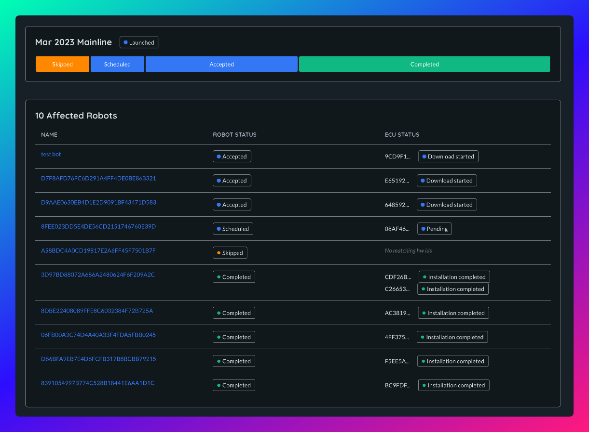

# Rollouts

Rollouts are the mechanism that orchestrates what, which and when updates should be rolled out to 
your fleet of robots.

At a high level a rollout is a map between ECUs and images. Creating a rollout involves specifying which images are due to be installed on which ECUs on which collection of robots.

## Creating a rollout
To create a rollout you must decide 2 things:
1. Which robots are targeted? Airbotics supports 3 target types for a rollout:
    1. Group - All robots in a particular group 
    2. Hardware ID - All robots that have at least one ECU with a given hardware ID. 
    3. Selected robots - A custom list of selected roots
2. Which images do you want to install on the ECUs from the targeted robots?
    - For each ECU with a given hardware ID, which image should be installed

You might be wondering, what happens if you target a rollout to a group of robots, some of which don't contain any ECUs with compatible hardware IDs for the image in the rollout? These robots (if any) will be included as part of the rollout but will be skipped over and no action will be taken. Airbotics **will never install** an image on an ECU with an incompatible hardware ID.

### Affected Robots
After making this selection Airbotics will compute and present to you which robots will be affected by the rollout and what images will be installed on which of their ECUs. You can see this before you finishing creating the rollout. It will also show you any robots that will be skipped over depending on their ECU hardware compatibility.

## Launching a rollout
It is important to note that creating a rollout will not trigger your fleet to start updating themselves. A created rollout goes into a `Prepared` state, allowing you to review and make changes (if desired) before it is launched. Once you are certain that the rollout is ready you can launch it. It is at this point that your robots will start to update.

## Monitoring a rollout
Launched rollouts can be monitored from the Rollout Detail page. From here you can see the overall status of the rollout and a summary of the affected robots and their current status in relation to the rollout. If you notice any errors from any ECUs, you can expect the ECU telemetry data on the Robot Detail page. 

## Rollout status
The rollout status shows the **overall** status of the rollout. 
An rollout status can be one of the following:

| Action      | Description                                                                                                     |
| ------------| ----------------------------------------------------------------------------------------------------------------|
| `Prepared`  | The rollout has been created but has not yet been launched. No robots will try to update.                       |
| `Launched`  | The rollout has been launched, affected robots will begin to try and  update.                                   |
| `Completed` | The rollout has been completed. All affected ECUs have tried (successfully or not) to update.                   |

## Robot and ECU status
You can also dive deeper and verify the status of each of the affected robots and their associated ECUs in the rollout. Please refer to [robot status](../components/robots/overview.md) and [ECU status](../components/robots/ecus.md) for more information.

Rollouts cannot be modified or delete once they have been created.
    
    

<!-- Viewing history -->
<!-- Statuses -->