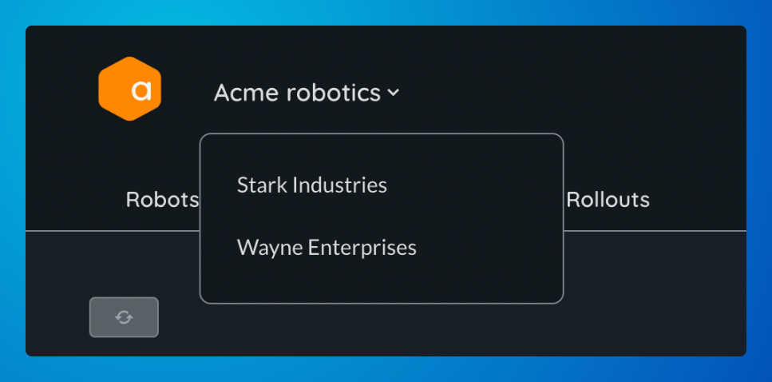

# Teams

Teams are owners of resources (robot, software images, etc.) in Airbotics. Accounts must be connected to at least one team and can belong to multiple teams.

## Viewing your teams

You can view which account you belong to, plus the role you have in them, from the teams tab of your account [page](https://dashboard.airbotics.io/account/teams).

## Switching between teams

You can switch between teams from the navigation bar, this will reload the dashboard and populate it with the resources of the chosen team.

## User roles

The roles that users can have within a team are:

| Role                                  | Description                                                              |
| ----------------------------------------| ------------------------------------------------------------------------ |
| `Admin`     | Administrator of the team. Has complete control of all aspects of the team. |

## Updating team information

Teams names can be changed under the general tab on the team [page](https://dashboard.airbotics.io/team/general).

## Members

Teams must have at least one member in them, you can view the current members from the members tab of the teams [page](https://dashboard.airbotics.io/team/members).

<!-- You can also remove members from here too. -->

## Transferring resources between teams

It is not currently possible to transfer resources (robots, software images, credentials, etc.) between teams.

## Deleting a team

You can delete a team at the bottom of the general tab of the team [page](https://dashboard.airbotics.io/team/general). This action will permanently delete all sources associated with the team (including robots, certificates, signing keys, software images, etc.).

After this, robots in the field will continue to attempt to interact with Airbotics and will be denied, they will need to be reflashed to begin interacting successfully again.

> Note: This action may affect robots in the field.