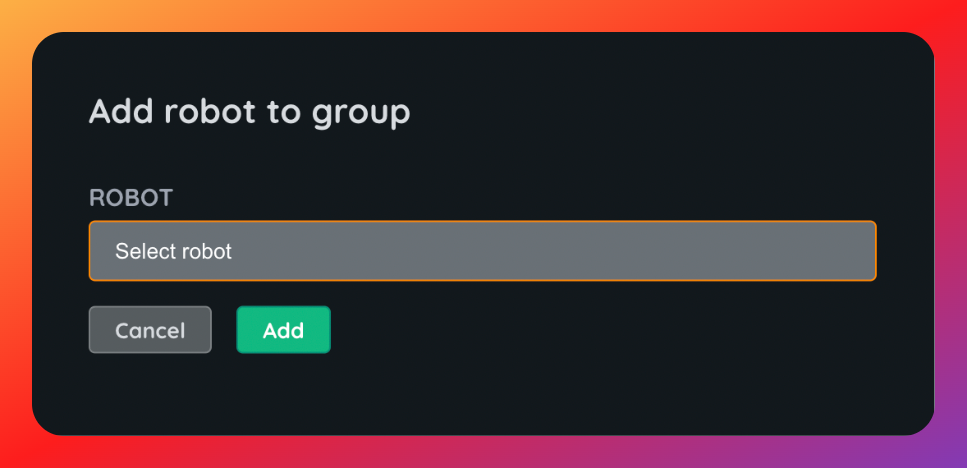

# Groups

Airbotics is designed to work with large fleet sizes, to help support this robots can be collected together into _Groups_ so software changes can be rolled out to multiple robots at once.

Groups can have many uses cases depending on your application. For example:
- A group of robots in a test facility / closed course for testing.
- A group of robots that should receive Beta releases ahead of others.
- A group of robots used only for demonstration purposes.
- Group robot by site or customer.
- Group robots by model or type.

Some considerations for working with groups:
- Robots can belong to zero or multiplle groups.
- A group can have zero or multiple robots in it.
- Groups can optionally be given a description.

## Adding a robot to a group

To add a robot to a group, navigate to the group detail page to which you want to add the robot, go to the robots tabs and click _Add_, select the robot from the dropdown list.

You cannot add a robot to a group from the robot detail page, you'll need to navigate to the group detail page and do it from there.

## Removing robots from a group

You can remove a robot from the robots tab on the group detail page. If you remove a robot from a group that has a rollout underway, the robot will still be included in the rollout.

## Deleting a group

If you delete a group it will still show up in rollouts that have targetted it, but you won't be able to click through to see the group. If you delete a group that is the target of a rollout while it is underway, the rollout will still proceed to the robots that were in the group.