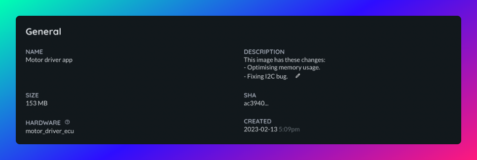

# Images

## Building images

Images for Airbotics are built using Yocto. They are full system images containing an operating system, drivers, application code and anything else your robot needs.

Images cannot be modified once they have been uploaded to Airbotics. To make a modification you'll need to build a new one.

<!-- OSTree
hardware
size
supported boards
storage - security, amount, stored in EU
description -->

## Storage

Images are stored on Airbotics infrastructure in the EU and are encrypted. The default storage limit on the free tier is 100GB. Building and pushing an image after this limit has been exceeded will fail.

## Using Yocto

Supported build arguments:

| Level                     | Description                                            |
| ------------------------- | ------------------------------------------------------ |
| `SOTA_PACKED_CREDENTIALS` | Absolute path to provisioning credentials. |
| `SOTA_HARDWARE_ID`        | Type of hardware ID this image can be deployed to. |
| `SOTA_POLLING_SEC`        | How often the agent should poll for updates in seconds. |

## Deleting images

You cannot delete an image if it is on a robot or due to be put on a robot.