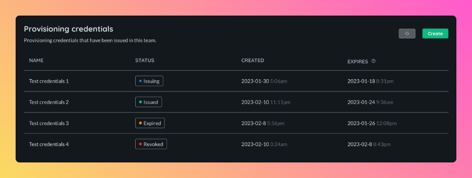

# Provisioning credentials

Provisioning credentials allows meta-updater to authenticate with the Airbotics backend and robots to provision themselves.

> Note: Provisioning credentials contain secrets, please keep them safe.

> Note: Once provisioning credentials expire or are revoked they cannot be used.

