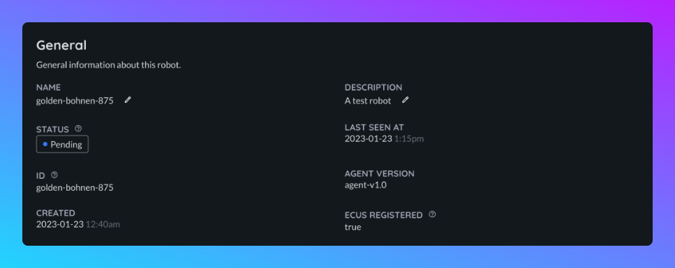
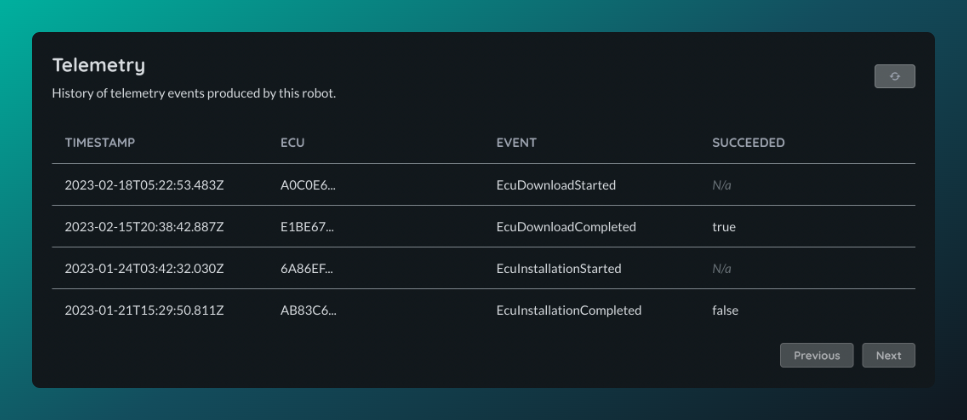

# Robots

IDs are automatically created by the robot when it provisions itself and cannot be changed.

The name of a robot is initiliased to be the same as the ID, but this can be changed. You can also optionally give a robot a description, by default a robot will not have a description.

Robots will report various information which can be viewed from the dashboard:
- The version of the agent
- When it was last seen
- Network information

## Viewing which ECUs are in a robot

ECUs cannot be modified, or added or removed from a robot, if you wish to make changes to an ECU you will need to delete the robot to which they belong and create another one with the changes you wish to make.

## Status

| Status                                  | Description                                                              |
| ----------------------------------------| ------------------------------------------------------------------------ |
| `Pending`     | A rollout has been targetted at one or more ECU on this robot but has not began. |
| `Underway`           | A rollout has been targetted at one or more ECU on this robot and is underway.    |
| `Up to date`     | All software on all ECUs in this robot is up-to-date.                      |

## Rollout history

You can view a history of all deployments sent to this robot from the dashboard. Below are the statuses supported:

| Status                                  | Description                                                              |
| ----------------------------------------| ------------------------------------------------------------------------ |
| `Pending`     | Rollout has been created but it hasn't been processed yet. |
| `Skipped`           | The update is not applicable for this robot.    |
| `Scheduled`           | The rollout has been scheduled for this robot.    |
| `Accepted`           | The robot has acknowledged the update and will process it.   |
| `Successful`           | The robot has successfully pulled the update.   |
| `Cancelled`           | The rollout was cancelled by a user.    |
| `Failed`           | The robot has tried and failed to pull the update.   |

## Telemetry

Robots will send telemetry events to Airbotics, these can be viewed on the telemetry tab of the robot detail page.

## Deleting a robot

Robots can be deleted at any time, this will permanentely remove all records of the robot in our database and revoke the certificate it uses to communicate. The agent on the robot will continue to attempt communicating with the backend unless it is removed or reconfigured.

