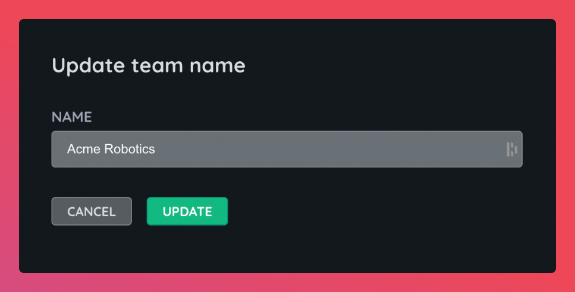

# Teams

Teams are the owner of resources in Airbotics. Accounts must be connected to at least one team and can belong to multiple teams.

## Updating team information

Teams names can be changed under the general tab on the team [page](https://dashboard.airbotics.io/team/general).

## Members

Teams must have at least one member in them, you can view the current members from the members tab of the teams [page](https://dashboard.airbotics.io/team/members).

You can also remove members from here too.

## Transferring resources between teams

It is not currently possible to transfer resources (robots, images, credentials, etc.) between teams.