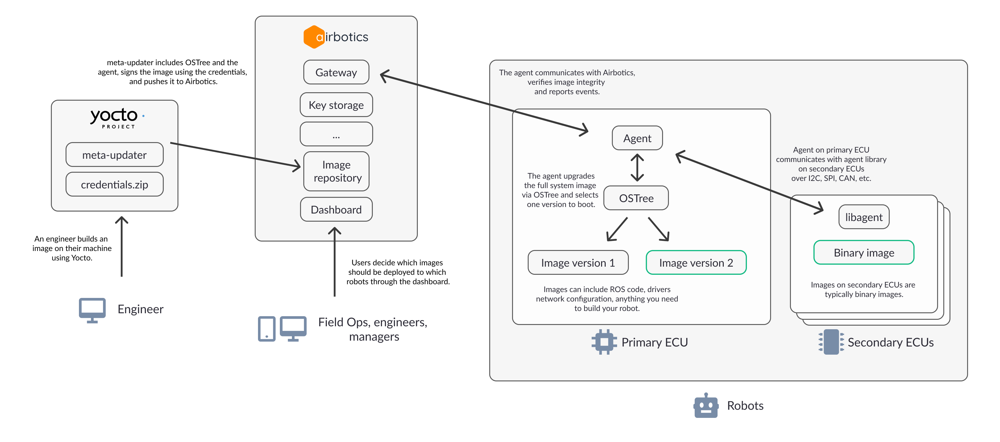

# Introduction

Airbotics is an open-source software deployment platform for robotics, with features like native ROS support, pull-based updates, support for updating embedded ECUs, all built on top of a state of the art security framework.

## Different ways to use Airbotics

Airbotics comes in two flavours:

**Airbotics Cloud:**

Airbotics cloud is our hosted and managed version of the Airbotics open-source platform. It always runs the latest version deployed to AWS in the EU and is managed, secured, scaled and monitored for you. We recommend Airbotics Cloud for the majority of users as it's the easiest way to get Airbotics running and is able to scale without requiring any changes from you. It also comes with 10 free robots.

**Self-hosted:**

If you need to keep your data on-premise you can always self-host Airbotics, you can make modifications to it subject to our [license](https://github.com/Airbotics/airbotics/blob/main/LICENSE). Check out our guide for getting started with the self-hosted version [here](guides/self-hosting.md).

## How does it work?
Robots run the Airbotics agent which extends the [Aktualizr](https://github.com/uptane/aktualizr/) client allowing it to securely receive OTA updates from our [Uptane-compatible](https://uptane.github.io/) server implementation.

## Architecture

