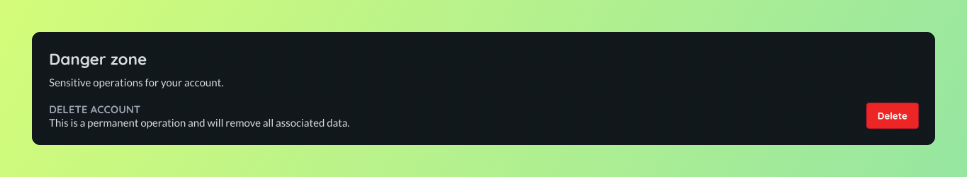

# Accounts

Accounts are how users interact with the Airbotics platform.

## Creating an account

Accounts are created through the [dashboard](https://dashboard.airbotics.io/registration). You must verify your email before continuing. There's no sales call or credit card required, you can start shipping software straight away.

## Updating account information

Account names can be changed under the general tab on the account [page](https://dashboard.airbotics.io/account/general).

## Deleting an account

At the bottom of the general tab on the account [page](https://dashboard.airbotics.io/account/general) you can delete your account. After confirming this action all data related to your account will be permanently deleted.

If you are the last remaining member of a team you will be prompted to also delete the team. Any robots connected to the team will no longer be able to communicate with Airbotics.

> Note: This action may affect robots in the field.

