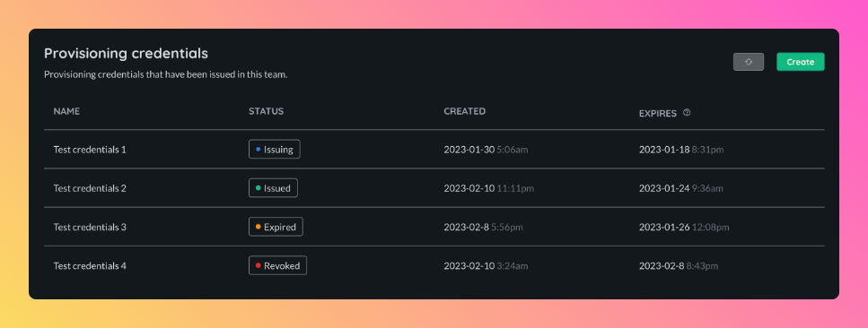

# Provisioning credentials

Provisioning credentials are zip files that contain various secrets that allow clients to authenticate with Airbotics, namely it allows users to sign and upload software images and for robots to provision themselves.

> Note: Provisioning credentials contain secrets, please keep them safe.

## Creating a provisioning credential

You can create a credential on the provisioning credentials tab of the team [page](https://dashboard.airbotics.io/team/provisioning-credentials). 

You will need to specify a date in the future for when the credential expires, after this date a credential will not be able to authenticate with Airbotics. It is not possible to modify the expiry date after a credential has been created.

> Note: Once provisioning credentials expire or are revoked they cannot be used to authenticate with Airbotics.

Once you choose an expiry date the credential will start to be issued, this may take some time (~10 seconds) to happen after which you will be able to download it to your local machine, the file will be called `credentials.zip`. You will only be able to do this once, if you loose the file you will have to create another one.

> Note: A credential can only be downloaded once.

## Viewing provisioning credentials issued to your team

You can view all credentials that have been issued to members of your team on the provisioning credentials tab of the team [page](https://dashboard.airbotics.io/team/provisioning-credentials).

Each credential will have a status that are explained below:

| Status    | Description                                                              |
| ----------| ------------------------------------------------------------------------ |
| `Issuing` | The credential is in the process of being issued and is not ready to be downloaded (this process should take ~10 seconds). |
| `Issued`  | The credential has been downloaded by a user and may be used to authenticate with Airbotics.   |
| `Expired` | The credential has expired and can no longer by used to authenticate with Airbotics.    |
| `Revoked` | The credential has been revoked and can no longer by used to authenticate with Airbotics.    |

## Revoking a provisioning credential

A provisioning credential can be revoked from the dashboard by clicking 'revoke' on the credential you want to revoke

> Note: This action may affect robots in the field.
