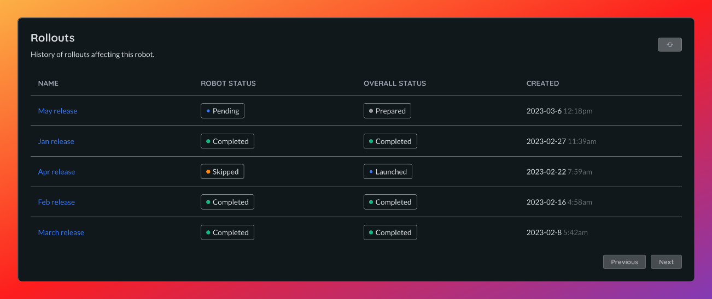

# Robots

A _robot_ is a networked machine for which Airbotics could update software. It could be a robot, a drone, or a vehicle. They are effectively a collection of networked, edge devices.

IDs are automatically created by the robot when it provisions itself and cannot be changed.

The name of a robot is initiliased to be the same as the ID, but this can be changed. You can also optionally give a robot a description, by default a robot will not have a description.

Robots will report various information which can be viewed from the dashboard:
- The version of the agent.
- When it was last seen.
- Network information.

## Robot Status

A robots update status is an aggregate of its ECU update status (see [ECU status](./ecus.md)). It allows you to see if a robot is completely up to date at a glance.
A robot can have one of the following status:

| Status      | Description                                                                |
| ------------| ---------------------------------------------------------------------------|
| `Updated`   | **All** ECUs on a robot are running the latest images.                     |
| `Updating`  | One or more ECUs on a robot are currently in the process of updating.      |
| `Failed`    | One or more ECUs on a robot failed to update to the latest version.        |

This status is will be updated as new software updates are applied to its ECUs through [rollouts](../rollouts.md).

## Rollout history

You can view a full history of all rollouts each robot has been apart of. Each rollout has an overall status 
(see [rollout status](../rollouts.md)) as well as a status for each robot targeted in the rollout which can be one of the following:

| Status        | Description                                                                                    |
| --------------| -----------------------------------------------------------------------------------------------|
| `Pending`     | Rollout has been created but the robot has not been processed yet.                             |
| `Skipped`     | Rollout is not applicable for this robot. (No compatible ECUs).                                |
| `Scheduled`   | Rollout is ready to be applied to the robot but the robot has not acknowledged it yet.         |
| `Accepted`    | Robot has acknowledged the update and has started to download and install the image(s).        |
| `Successful`  | Robot has successfully pulled and installed the update, all ECUs are running the latest image. |
| `Cancelled`   | Rollout was cancelled by a user.                                                               |
| `Failed`      | Robot has tried and failed to download and/or install the update.                              |

 

## Deleting a robot

Robots can be deleted at any time, this will permanentely remove all records of the robot in our database and revoke the certificate it uses to communicate. The agent on the robot will continue to attempt communicating with the backend unless it is removed or reconfigured.

