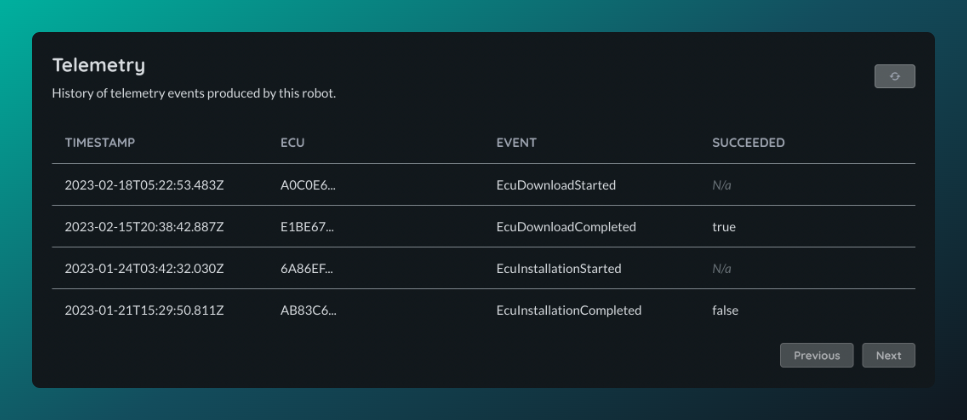
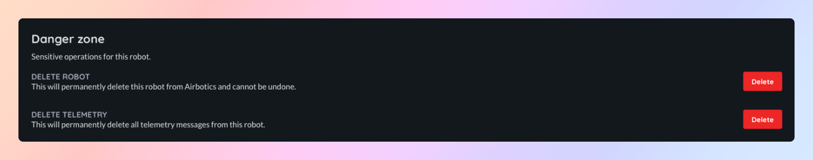

# Telemetry

All meaningful events produced by the agent on robots will be sent to Airbotics as for root-cause analysis and troubleshooting.

## Viewing telemetry

You can view telemetry events sent by a robot on the telemetry tab of the robot detail page. Each event will be associated to a single ECU and will show the time the event occurred **on the device**. The supported events are listed below:

| Status    | Description                                                              |
| ----------| ------------------------------------------------------------------------ |
| `Download started` | The agent as begun downloading an image. |
| `Download completed`  | The agent has successfully downloaded an image. |
| `Download failed` | The agent has unsuccessfully downloaded an image. This could be because of network interruption, storage space limitation, etc.   |
| `Installation started` | The agent has started to install an image that has been successfully downloaded.   |
| `Installation applied` | The agent has applied ian installation and is now awaiting a reboot to complete the installation.  |
| `Installation completed` | The agent has successfully completed installing a downloaded image.  |
| `Installation failed` | The agent has failed to complete installing a downloaded image.   |

## Deleting telemetry

You can delete all telemetry associated with a single robot at the bottom the general tab of the robot detail page. This action is permanent and cannot be undone.

